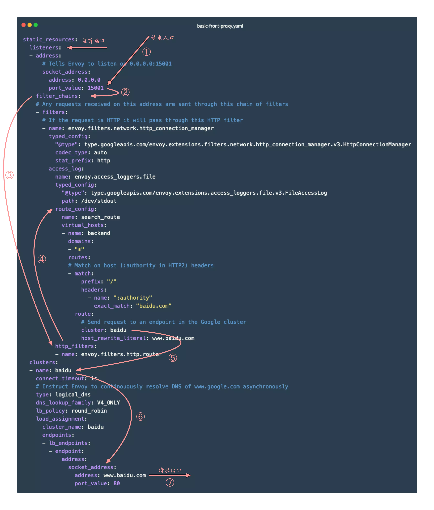

---
tags:
  - Envoy
  - 云原生
  - 网关
  - 网络
---

### **概念**

Envoy是一种L7代理和通信总线，专为大型现代面向服务的架构而设计。

```shell
Envoy is an L7 proxy and communication bus designed for large modern service oriented architectures.
```


控制平面：决策方

为网格中的所有正在运行的数据平面提供策略和配置，从而将所有数据平面联合构建为分布式系统，他不接触系统中的任何数据包或请求；

数据平面：执行方

触及系统中的每个数据包或请求，负责服务发现、健康检查、路由、负载均衡、身份验证、授权和可观测性等；


### 镜像地址

```shell
docker.io/envoyproxy/envoy:v1.22.7
```


### **默认配置文件**

```yaml
admin:
  address:
    socket_address:
      protocol: TCP
      address: 0.0.0.0
      port_value: 9901
static_resources:
  listeners:
  - name: listener_0
    address:
      socket_address:
        protocol: TCP
        address: 0.0.0.0
        port_value: 10000
    filter_chains:
    - filters:
      - name: envoy.filters.network.http_connection_manager
        typed_config:
          "@type": type.googleapis.com/envoy.extensions.filters.network.http_connection_manager.v3.HttpConnectionManager
          scheme_header_transformation:
            scheme_to_overwrite: https
          stat_prefix: ingress_http
          # 主要更新路由这个部分
          route_config:
            name: local_route
            virtual_hosts:
            - name: local_service
              domains: ["*"]
              routes:
              - match:
                  prefix: "/"
                route:
                  host_rewrite_literal: www.envoyproxy.io
                  cluster: service_envoyproxy_io
          http_filters:
          - name: envoy.filters.http.router
            typed_config:
              "@type": type.googleapis.com/envoy.extensions.filters.http.router.v3.Router
  clusters:
  - name: service_envoyproxy_io
    connect_timeout: 30s
    type: LOGICAL_DNS
    # Comment out the following line to test on v6 networks
    dns_lookup_family: V4_ONLY
    lb_policy: ROUND_ROBIN
    load_assignment:
      cluster_name: service_envoyproxy_io
      endpoints:
      - lb_endpoints:
        - endpoint:
            address:
              socket_address:
                address: www.envoyproxy.io
                port_value: 443
    transport_socket:
      name: envoy.transport_sockets.tls
      typed_config:
        "@type": type.googleapis.com/envoy.extensions.transport_sockets.tls.v3.UpstreamTlsContext
        sni: www.envoyproxy.io
```

- `listener` : Envoy 的监听地址，就是真正干活的。Envoy 会暴露一个或多个 Listener 来监听客户端的请求。
- `filter` : 过滤器。在 Envoy 中指的是一些“可插拔”和可组合的逻辑处理层，是 Envoy 核心逻辑处理单元。
- `route_config` : 路由规则配置。即将请求路由到后端的哪个集群。
- `cluster` : 服务提供方集群。Envoy 通过服务发现定位集群成员并获取服务，具体路由到哪个集群成员由负载均衡策略决定。



具体的路径匹配规则参考官方文档：

```shell
https://www.envoyproxy.io/docs/envoy/latest/api-v3/config/route/v3/route_components.proto#envoy-v3-api-msg-config-route-v3-route
```


根据 header 头匹配不同路由：

```yaml
route_config:
  name: local_route
  virtual_hosts:
  - name: local_service
    domains: ["*"]
    routes:
    ## 根据 header 跳转不同路由
    - match:
        prefix: "/"
        headers:
        - name: token
          exact_match: "v1"
      direct_response:
        status: 200
        body:
          inline_string: "v1"
    - match:
        prefix: "/"
        headers:
        - name: token
          exact_match: "v2"
      direct_response:
        status: 200
        body:
          inline_string: "v2"
```


### Cors 跨域配置

```yaml
static_resources:
  listeners:
  - name: listener_0
    address:
      socket_address:
        protocol: TCP
        address: 0.0.0.0
        port_value: 10000
    filter_chains:
    - filters:
      - name: envoy.filters.network.http_connection_manager
        typed_config:
          "@type": type.googleapis.com/envoy.extensions.filters.network.http_connection_manager.v3.HttpConnectionManager
          stat_prefix: ingress_ws_to_ws
          upgrade_configs:
          - upgrade_type: websocket
          route_config:
            name: local_route
            virtual_hosts:
            - name: app
              domains: ["*"]
              # 跨域配置
              cors:
                allow_origin_string_match: 
                  - prefix: "*"
                allow_methods: GET, PUT, DELETE, POST, OPTIONS
                allow_headers: x-copark-cloud-inner-token,x-copark-cloud-user-token,x-terminal,x-copark-cloud-current-company-token,x-copark-cloud-tenant-admin-token,x-copark-cloud-company-manager-token,keep-alive,user-agent,cache-control,content-type,content-transfer-encoding,custom-header-1,x-accept-content-transfer-encoding,x-accept-response-streaming,x-user-agent,x-grpc-web,grpc-timeout
              routes:
              # 平台
              - match:
                  prefix: "/copark-cloud-platform"
                route:
                  cluster: copark-cloud-platform
              # 访客
              - match:
                  prefix: "/cv-server"
                route:
                  cluster: cv-server
              # 报餐    
              - match:
                  prefix: "/canteen-server"      
                route:
                  cluster: canteen-dev    
              # 报餐消息    
              - match:
                  prefix: "/copark-mc"
                route:
                  cluster: copark-mc       
              # 人行
              - match:
                  prefix: "/cf-pass"
                route:
                  cluster: cf-pass-dev 
              # 车行
              - match:
                  prefix: "/cp-server"
                route:
                  cluster: cp-server-dev
              # 天气
              - match:
                  prefix: "/component/weather"
                route:
                  cluster: cowain-weather              
          http_filters:
          # 跨域过滤器
          - name: envoy.filters.http.cors
            typed_config:
              "@type": type.googleapis.com/envoy.extensions.filters.http.cors.v3.Cors
          - name: envoy.filters.http.router
            typed_config:
              "@type": type.googleapis.com/envoy.extensions.filters.http.router.v3.Router
  clusters:
  - name: cv-server
    connect_timeout: 30s
    type: LOGICAL_DNS
    dns_lookup_family: V4_ONLY
    lb_policy: ROUND_ROBIN
    load_assignment:
      cluster_name: cv-server
      endpoints:
      - lb_endpoints:
        - endpoint:
            address:
              socket_address:
                address: cv-server-dev.cowain
                port_value: 18081
  - name: copark-mc
    connect_timeout: 30s
    type: LOGICAL_DNS
    dns_lookup_family: V4_ONLY
    lb_policy: ROUND_ROBIN
    load_assignment:
      cluster_name: copark-mc
      endpoints:
      - lb_endpoints:
        - endpoint:
            address:
              socket_address:
                address: copark-mc-dev.cowain
                port_value: 9000
  - name: canteen-dev
    connect_timeout: 30s
    type: LOGICAL_DNS
    dns_lookup_family: V4_ONLY
    lb_policy: ROUND_ROBIN
    load_assignment:
      cluster_name: canteen-dev
      endpoints:
      - lb_endpoints:
        - endpoint:
            address:
              socket_address:
                address: canteen-dev.cowain
                port_value: 8086
  - name: cf-pass-dev
    connect_timeout: 30s
    type: LOGICAL_DNS
    dns_lookup_family: V4_ONLY
    lb_policy: ROUND_ROBIN
    load_assignment:
      cluster_name: cf-pass-dev
      endpoints:
      - lb_endpoints:
        - endpoint:
            address:
              socket_address:
                address: cf-pass-dev.cowain
                port_value: 18080
  - name: cp-server-dev
    connect_timeout: 30s
    type: LOGICAL_DNS
    dns_lookup_family: V4_ONLY
    lb_policy: ROUND_ROBIN
    load_assignment:
      cluster_name: cp-server-dev
      endpoints:
      - lb_endpoints:
        - endpoint:
            address:
              socket_address:
                address: cp-server-dev.cowain
                port_value: 8080
  - name: copark-cloud-platform
    connect_timeout: 30s
    type: LOGICAL_DNS
    dns_lookup_family: V4_ONLY
    lb_policy: ROUND_ROBIN
    load_assignment:
      cluster_name: copark-cloud-platform
      endpoints:
      - lb_endpoints:
        - endpoint:
            address:
              socket_address:
                address: copark-cloud-biz.platform
                port_value: 8080   
  - name: cowain-weather
    connect_timeout: 30s
    type: LOGICAL_DNS
    dns_lookup_family: V4_ONLY
    lb_policy: ROUND_ROBIN
    load_assignment:
      cluster_name: cowain-weather
      endpoints:
      - lb_endpoints:
        - endpoint:
            address:
              socket_address:
                address: weather.cowain
                port_value: 8080
```


### 参考资料

[Envoy 中文指南](https://icloudnative.io/envoy-handbook/docs/gettingstarted/quick-start/)
