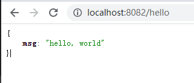

### 环境配置

go 国内镜像仓库配置

```shell
go env -w GO111MODULE=on
go env -w GOPROXY=https://mirrors.aliyun.com/goproxy/,direct
```

### Gin

#### 安装命令

```shell
go get -u github.com/gin-gonic/gin
```


#### Hello

``` go
package main

import "github.com/gin-gonic/gin"

func main() {

	// 创建一个服务
	ginServer := gin.Default()

	// 访问地址，处理请求
	ginServer.GET("/hello", func(context *gin.Context) {
		context.JSON(200, gin.H{"msg": "hello, world"})
	})

	ginServer.Run(":8082")
}
```

