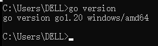
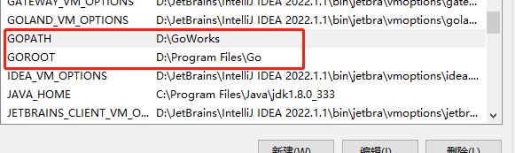
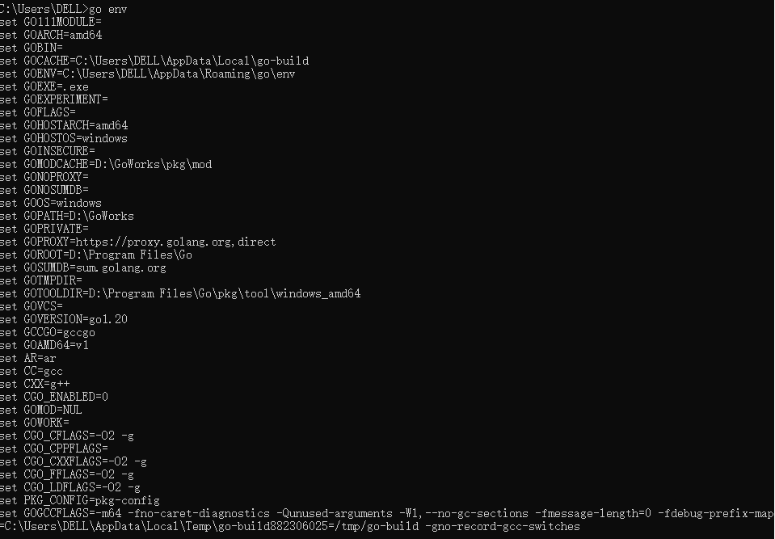
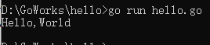

---
tags:
  - Go
  - 编程
  - 后端
---

### 环境搭建

https://go.dev/learn/








### Hello，World！

```go
package main
import "fmt"

func main() {
	fmt.Println("Hello,World")
}
```




### 变量

#### 变量

```go
package main
import "fmt"

func main() {
	var name string = "zhangsan"
	name = "fxk"
	fmt.Println(name)
}
```

```go
package main

import "fmt"

func main() {
	var name string = "zhangsan"
	var age int = 18
	name = "fxk"
	fmt.Println(name, age)
}
```


变量存在默认值

```go
package main

import "fmt"

func main() {
    // 定义变量，没有赋值，默认就是这个类型的默认值
	var (
		name string
		age  int
		addr string
	)

	fmt.Println(name, age, addr)
}
```

```shell
 0
```

**变量赋值，语法糖**

```go
package main

import "fmt"

func main() {
   name := "fxk"
   age := 1
   addr := "中国"

   fmt.Println(name, age, addr)
}
```

```go
package main

import "fmt"

func main() {
	name := "fxk"
	age := 1
	addr := "中国"

	fmt.Println(name, age, addr)
	fmt.Printf("%T,%T", name, age)
}

// 输出：
fxk 1 中国
string,int
Process finished with the exit code 0
```

**变量内存空间**

```go
package main

import "fmt"

func main() {
	var num int
	num = 100
	fmt.Printf("num:%d, 内存地址:%p\n", num, &num) // 取地址符 &变量名

	num = 200
	fmt.Printf("num:%d, 内存地址:%p\n", num, &num) // 取地址符 &变量名
}

// 输出
num:100, 内存地址:0xc00001c098
num:200, 内存地址:0xc00001c098
```

**变量交换**

```go
package main

import "fmt"

func main() {
	var a int = 100
	var b int = 200

	b, a = a, b
	fmt.Println(a, b)
}
// 输出
200 100
```

**匿名变量**

```go
package main

import "fmt"

func test() (int, int) {
	return 100, 200

}
func main() {
	// 任何赋值给这个标识符的值都将被抛弃
	a, _ := test()
	fmt.Print(a)
}
```

#### 常量

`const`

```go
package main

import "fmt"

func main() {
	const URL = "www.baidu.com"
	fmt.Println(URL)
}
// 输出
www.baidu.com
```


#### iota

 ```go
 package main
 
 func main() {
 	const (
 		a = iota
 		b
 		c
 		d = 100
 		e = "哈哈"
 		h = iota
 		i
 	)
 	const (
 		j = iota
 		k
 	)
 	println(a, b, c, d, e, h, i, j, k)
 }
 
 // 输出
 0 1 2 100 哈哈 5 6 0 1
 ```


### 基本数据类型                                                                                                                                                                     

#### 类型转换

```go
package main

import "fmt"

// 类型转换
// 转换后的变量 := 要转换的类型(变量)
func main() {
	a := 3
	b := 5.0

	// 将int类型的a转换为 float64 类型 类型转换
	c := float64(a)

	fmt.Printf("%T\n", a)
	fmt.Printf("%T\n", b)
	fmt.Printf("%T\n", c)
}

// 输出
int
float64
float64
```


### 运算符

```go
package main

import "fmt"

func main() {
	var a = 10
	var b = 3

	fmt.Println(a + b)
	fmt.Println(a - b)
	fmt.Println(a * b)
	fmt.Println(a / b)
	fmt.Println(a % b)
	a++
	fmt.Println(a)
	a--
	fmt.Println(a)
}
// 输出
13
7 
30
3 
1 
11
10
```


```go
package main

import "fmt"

func main() {

	// 二进制

	// 60  0011 1100
	// 13  0000 1101
	// --------------
	// &   0000 1100  同时满足
	// |   0011 1101  一个满足即可

	var a uint = 60
	var b uint = 13
	// 位运算

	var c uint = 0

	c = a & b
	fmt.Printf("%d, 二进制%b\n", c, c)

	c = a | b
	fmt.Printf("%d, 二进制%b", c, c)
}
// 输出
12, 二进制1100
61, 二进制111101
```


### 获取键盘输入

```go
package main

import "fmt"

func main() {

	var x int
	var y float64

	// 定义了两个变量，用键盘来录入两个变量

	fmt.Println("请输入两个数：1、整数， 2、浮点数：")
	// 变量取地址 &变量
	fmt.Scanln(&x, &y)
	fmt.Println("x:", x)
	fmt.Println("y:", y)
}
// 输入
请输入两个数：1、整数， 2、浮点数：
1 3.14
x: 1   
y: 3.14
```


### 流程控制

- 顺序结构
  - 从上到下，逐行执行，默认的逻辑
- 选择结构
  - if
  - switch
  - select

- 循环结构
  - for

#### if

```go
// if
package main

import "fmt"

func main() {

	var a, b int
	var pwd int = 20221020

	fmt.Println("请输入密码：")
	fmt.Scanln(&a)

	if a == pwd {
		fmt.Println("请再次输入密码：")
		fmt.Scanln(&b)
		if b == pwd {
			fmt.Println("登录成功")
		} else {
			fmt.Println("登录失败，第二次密码错误")
		}
	} else {
		fmt.Println("登录失败，密码错误")
	}
}

// 输出
请输入密码：
20221020
请再次输入密码：
20221020
登录成功
```

#### switch

```go
package main

import "fmt"

// switch 语句
func main() {

	var score int = 55

	switch score {
	case 90:
		fmt.Println("A")
	case 80:
		fmt.Println("B")
	case 50, 60, 70:
		fmt.Println("C")
	default:
		fmt.Println("D")
	}

	switch {
	case false:
		fmt.Println("false")
	case true:
		fmt.Println("true")
	default:
		fmt.Println("其他")
	}
}
// 输出
D
true
```

> fallthrough  case 穿透，不管下一个条件满不满足，都会执行

```go
package main

import "fmt"

func main() {

	var a = false

	switch a {
	case false:
		fmt.Println("1. case 为 false")
		fallthrough // case 穿透，不管下一个条件满不满足，都会执行
	case true:
		fmt.Println("2. case 为 true")
	}
}
// 输出
1. case 为 false
2. case 为 true
```

#### for

```go
// for
package main

import "fmt"

func main() {

	// 循环10次
	i := 1
	for i <= 10 {
		fmt.Println(i)
		i++
	}

	//sum := 0
	//for i := 1; i <= 10; i++ {
	//	sum += i
	//}
	//fmt.Println(sum)
}
// 输出
1
2
3
4
5
6
7
8
9
10
```

```go
package main

import "fmt"

func main() {
	//for i := 0; i < 5; i++ {
	//	for j := 0; j < 5; j++ {
	//		fmt.Print("*")
	//	}
	//	fmt.Print("\n")
	//}

	for j := 1; j <= 9; j++ {
		for i := 1; i <= j; i++ {
			fmt.Printf("%d*%d=%d \t", i, j, i*j)
		}
		fmt.Printf("\n")
	}
}

// 输出
1*1=1
1*2=2   2*2=4                                                          
1*3=3   2*3=6   3*3=9                                                  
1*4=4   2*4=8   3*4=12  4*4=16                                         
1*5=5   2*5=10  3*5=15  4*5=20  5*5=25                                 
1*6=6   2*6=12  3*6=18  4*6=24  5*6=30  6*6=36                         
1*7=7   2*7=14  3*7=21  4*7=28  5*7=35  6*7=42  7*7=49                 
1*8=8   2*8=16  3*8=24  4*8=32  5*8=40  6*8=48  7*8=56  8*8=64         
1*9=9   2*9=18  3*9=27  4*9=36  5*9=45  6*9=54  7*9=63  8*9=72  9*9=81 
```


`for range`

```go
package main

import "fmt"

func main() {

	// acsii 编码
	str := "hello,world"
	fmt.Println(str)

	// 获取字符串的长度
	fmt.Println("字符串的长度为：", len(str))

	// 获取指定的字节
	//fmt.Println("字节打印：", str[2])
	//fmt.Printf("%c", str[2])

	//for i := 0; i < len(str); i++ {
	//	fmt.Printf("%c\n", str[i])
	//}

	// for range循环，便利数组、切片
	for i, v := range str {
		fmt.Printf("%d, %c\n", i, v)
	}
}
// 输出
hello,world
字符串的长度为： 11
0, h               
1, e               
2, l               
3, l               
4, o               
5, ,               
6, w               
7, o               
8, r               
9, l               
10, d  
```


### 函数

#### 函数多个返回值

```go
package main

import "fmt"

func main() {
	fmt.Println(add(1, 2))
	fmt.Println(swap("学习", "发财"))
}

//		func 函数名（参数，参数 ……） 函数调用后的返回值 {
//		 函数体：执行一段代码
//	}
func add(a, b int) int {
	c := a + b
	return c
}

// 返回多个值的函数
func swap(x, y string) (string, string) {
	return y, x
}

// 输出
3
发财 学习
```

#### 可变参数

```go
package main

import "fmt"

func main() {
	getSum(1, 2, 3, 4, 5)
}

// ... 可变参数
func getSum(nums ...int) {
	sum := 0
	for i := 0; i < len(nums); i++ {
		println(nums[i])
		sum += nums[i]
	}
	fmt.Println("sum: ", sum)
}

// 输出
1
2       
3       
4       
5       
sum:  15
```


#### 参数传递

- 值类型的数据：操作的是数据本身 int、string、bool、float64、array
- 引用类型的数据：操作的是数据的地址 slice、map、chan


值传递

```go
package main

import "fmt"

func main() {
	// 值传递

	arr := [4]int{1, 2, 3, 4}
	// 值传递：传递是数据的副本，修改数据对原始数据没有影响
	updateArray(arr)
	fmt.Println("arr2修改后的数据：", arr)

}

func updateArray(arr2 [4]int) {
	fmt.Println("arr2接收的数据：", arr2)
	arr2[0] = 100
	fmt.Println("arr2修改后的数据：", arr2)
}

// 输出
arr2接收的数据： [1 2 3 4]
arr2修改后的数据： [100 2 3 4]
arr2修改后的数据： [1 2 3 4]  
```


引用传递

```go
package main

import "fmt"

func main() {
	// 引用传递
	s1 := []int{1, 2, 3, 4}

	// 切片是引用类型的数据 
	fmt.Println("默认的数据：", s1)
	update2(s1)
	fmt.Println("arr2修改后的数据：", s1)

}

func update2(s2 []int) {
	fmt.Println("传递的数据：", s2)
	s2[0] = 100
	fmt.Println("修改后的数据：", s2)
}

// 输出
默认的数据： [1 2 3 4]
s2传递的数据： [1 2 3 4]    
s2修改后的数据： [100 2 3 4]
修改后的数据： [100 2 3 4]  
```


#### 递归函数

```go
package main

import "fmt"

func main() {
	sum := getSum2(5)
	fmt.Println(sum)
}

func getSum2(n int) int {

	if n == 1 {
		return 1
	}
	return getSum2(n-1) + n
}

// 输出
15
```

#### 匿名函数

```go
package main

import "fmt"

// func()
func main() {
	fmt.Printf("%T", f1)
	f1()
	f2 := f1
	f2()

	// 匿名函数
	f3 := func() {
		fmt.Println("我是f3函数")
	}

	f3()

	r1 := func(a, b int) int {
		fmt.Println(a, b)
		fmt.Println("我是匿名函数")
		return a + b
	}(1, 2)
	fmt.Println(r1)
}

func f1() {
	fmt.Println("我是f1函数")
}

// 输出
func()我是f1函数
我是f1函数      
我是f3函数      
1 2             
我是匿名函数    
3         
```

#### 函数式编程

fun1(), fun2()

将fun1函数作为fun2这个函数的参数

fun2函数：就叫做高阶函数，接收了一个函数作为参数的函数

fun1函数：就叫做回调函数，作为另外一个函数的参数

```go
package main

import "fmt"

// func()
func main() {
	r1 := add2(1, 2)
	fmt.Println(r1)

	r2 := oper(3, 4, add2)
	fmt.Println(r2)
}

// 高阶函数
func oper(a, b int, fun func(int, int) int) int {

	r := fun(a, b)
	return r

}
func add2(a, b int) int {
	return a + b
}
```


```go
package main

import "fmt"

// func()
func main() {
	r1 := add2(1, 2)
	fmt.Println(r1)

	r2 := oper(3, 4, add2)
	fmt.Println(r2)

	r3 := oper(8, 4, sub)
	fmt.Println(r3)

	r4 := oper(8, 4, func(a, b int) int {
		if b == 0 {
			fmt.Println("除数不能为0")
			return 0
		}
		return a / b
	})
	fmt.Println(r4)
}

// 高阶函数
func oper(a, b int, fun func(int, int) int) int {

	r := fun(a, b)
	return r

}
func add2(a, b int) int {
	return a + b
}
func sub(a, b int) int {
	return a - b
}
// 输出
3
7
4
2
```


#### 闭包


一个外层函数中，有内层函数，该内层函数中，会操作外层函数的局部变量并且该外层函数的返回值就是这个内层函数。这个内层函数和外层函数的局部变量，统称为闭包结构

局部变量的生命周期就会发生改变，正常的局部变量会随着函数的调用而创建，随着函数的结束而销毁但是闭包结构中的外层函数的局部变量并不会随着外层函数的结束而销毁，因为内层函数还在维续使用

```go
package main

import "fmt"

func main() {

	r1 := increment()
	fmt.Println(r1)

	v1 := r1()
	fmt.Println(v1)

	v2 := r1()
	fmt.Println(v2)
	fmt.Println(r1())
	fmt.Println(r1())
	fmt.Println(r1())

	// increment()
	r2 := increment()
	v3 := r2()
	fmt.Println(v3)
	fmt.Println(r1())
	fmt.Println(r2())
}

// 自增
func increment() func() int {
	// 局部变量i
	i := 0
	// 定义了一个匿名函数，给变量自增并返回
	fun := func() int { // 内层函数，没有执行
		i++
		return i
	}
	return fun
}

// 输出
0x629d60
1
2
3
4
5
1
6
2
```


