### docker 概述

项目+环境打包上线

docker 思想来源于集装箱

本质：所有的技术都是因为出现了一些问题，我们需要去解决，才去学习。

Go语言开发的

### docker 安装

#### docker 基本组成

**镜像（image）：**模板，可以通过模板创建容器服务

**容器（container）：**docker 利用容器技术，独立运行一个或一个组应用，通过镜像来创建的

**仓库（respository）：** 存放镜像的地方

docker hub（国外）

阿里云

#### 安装docker

> 环境查看

```shell
[root@VM-4-2-centos /]# uname -r
3.10.0-1160.49.1.el7.x86_64
[root@VM-4-2-centos /]# cat /etc/os-release
NAME="CentOS Linux"
VERSION="7 (Core)"
ID="centos"
ID_LIKE="rhel fedora"
VERSION_ID="7"
PRETTY_NAME="CentOS Linux 7 (Core)"
ANSI_COLOR="0;31"
CPE_NAME="cpe:/o:centos:centos:7"
HOME_URL="https://www.centos.org/"
BUG_REPORT_URL="https://bugs.centos.org/"

CENTOS_MANTISBT_PROJECT="CentOS-7"
CENTOS_MANTISBT_PROJECT_VERSION="7"
REDHAT_SUPPORT_PRODUCT="centos"
REDHAT_SUPPORT_PRODUCT_VERSION="7"
```

docker-ce 社区 docker-ee 企业版


#### 卸载docker

```shell
#1. 卸载依赖
yum remove docker-ce docker-ce-cli containerd.io
#2. 删除资源
rm -rf /var/lib/docker
# /var/lib/docker docker的默认工作路径
```

#### 容器镜像加速

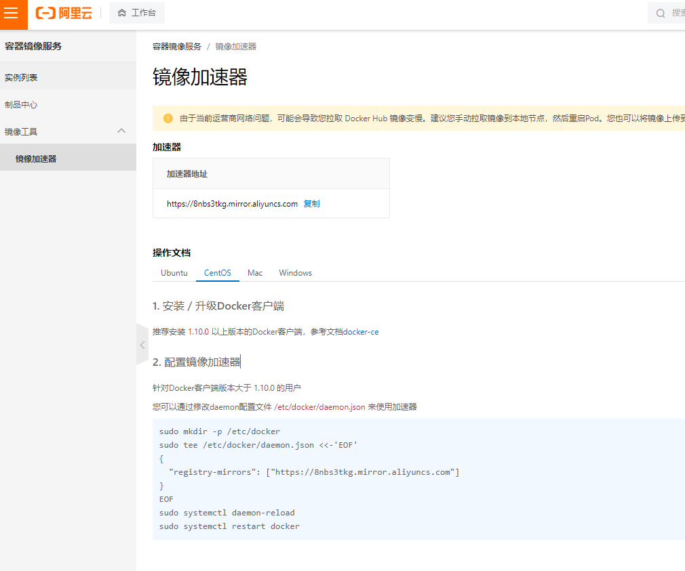


### docker 常用命令

```shell
docker verison  # docker 版本
docker info     # docker容器信息
docker 命令 -- help # 帮助命令
```


#### 镜像命令

```shell
docker iamges
docker images -a # 所有镜像
docker images -q # 所有镜像id
docker search mysql # 搜索镜像
docker pull mysql   # 拉取镜像、默认下载最新的
```


```shell
[root@VM-4-2-centos /]# docker pull mysql
Using default tag: latest # 不写tag，默认就是latest
latest: Pulling from library/mysql 
72a69066d2fe: Pull complete  # 分层下载，docker image的核心 联合文件系统
93619dbc5b36: Pull complete
99da31dd6142: Pull complete
626033c43d70: Pull complete
37d5d7efb64e: Pull complete
ac563158d721: Pull complete
d2ba16033dad: Pull complete
688ba7d5c01a: Pull complete
00e060b6d11d: Pull complete
1c04857f594f: Pull complete
4d7cfa90e6ea: Pull complete
e0431212d27d: Pull complete
Digest: sha256:e9027fe4d91c0153429607251656806cc784e914937271037f7738bd5b8e7709  # 签名
Status: Downloaded newer image for mysql:latest
docker.io/library/mysql:latest  #真实地址

# 等价于它
docker pull mysql
docker pull docker.io/library/mysql:latest
```

#### 容器命令

```shell
docker run [可选参数] image

# 参数说明
--name="Name"   容器名字
-d              后台方式运行
-it             使用交互方式运行
-p              指定容器端口 -p 8080:8080
-P              随机指定端口

# 启动并进入容器
[root@VM-4-2-centos /]# docker run -it centos /bin/bash
[root@a536ff72ec73 /]#
# 查看容器内的centos
[root@a536ff72ec73 /]# ls
bin  dev  etc  home  lib  lib64  lost+found  media  mnt  opt  proc  root  run  sbin  srv  sys  tmp  usr  var
[root@a536ff72ec73 /]#


[root@VM-4-2-centos /]# docker ps -a
CONTAINER ID   IMAGE          COMMAND                  CREATED              STATUS                      PORTS                                       NAMES
a536ff72ec73   centos         "/bin/bash"              About a minute ago   Exited (0) 35 seconds ago                                               serene_mclean
e768076e65ae   redis:latest   "docker-entrypoint.s…"   5 months ago         Up 51 minutes               0.0.0.0:6379->6379/tcp, :::6379->6379/tcp   redis
```


**删除容器**

```shell
docker rm 容器id # 删除指定容器，不能删除正在运行的容器，如果要强制删除 rm -f
docker rm -f $(docker ps -aq) # 删除所有的容器
docker ps -a -q | xargs docker rm # 删除所有的容器
```


#### 常用其他命令

```shell
# 命令 docker run -d 镜像名
docker run -d centos 

# 问题 docker ps，发现centos 停止了
# 常见的坑： docker 容器使用后台运行，就必须要有一个前台进程，docker 发现没有应用，就会自动停止
# nginx，容器启动后，发现自己没有提供服务，就会like停止，就是没有程序了

```

```shell
docker logs -f -t --tail 容器id

# 显示日志
-tf
--tail number

[root@VM-4-2-centos /]# docker logs -tf --tail 20 e768076e65ae
2023-01-16T07:56:36.968859604Z 1:M 16 Jan 2023 07:56:36.963 * Loading RDB produced by version 7.0.4
2023-01-16T07:56:36.968862894Z 1:M 16 Jan 2023 07:56:36.963 * RDB age 339905 seconds
2023-01-16T07:56:36.968866165Z 1:M 16 Jan 2023 07:56:36.963 * RDB memory usage when created 1.06 Mb
2023-01-16T07:56:36.968869375Z 1:M 16 Jan 2023 07:56:36.963 * Done loading RDB, keys loaded: 0, keys expired: 0.
2023-01-16T07:56:36.968872646Z 1:M 16 Jan 2023 07:56:36.963 * DB loaded from disk: 0.001 seconds
2023-01-16T07:56:36.968875847Z 1:M 16 Jan 2023 07:56:36.963 * Ready to accept connections
2023-01-16T08:13:52.168402089Z 1:M 16 Jan 2023 08:13:52.168 * DB saved on disk
```


**查看容器中进程信息**

```shell
docker top 容器ID
```

**查看容器的元数据**

```shell
[root@VM-4-2-centos /]# docker inspect --help

Usage:  docker inspect [OPTIONS] NAME|ID [NAME|ID...]

Return low-level information on Docker objects

Options:
  -f, --format string   Format the output using the given Go template
  -s, --size            Display total file sizes if the type is container
      --type string     Return JSON for specified type
```

```shell
[root@VM-4-2-centos /]# docker inspect e768076e65ae
[
    {
        "Id": "e768076e65ae896574f8e39010e3a1adec96a3c2dc38d34a2ee5ba00bb5a65ed",
        "Created": "2022-07-27T08:39:58.6000576Z",
        "Path": "docker-entrypoint.sh",
        "Args": [
            "redis-server"
        ],
        "State": {
            "Status": "running",
            "Running": true,
            "Paused": false,
            "Restarting": false,
            "OOMKilled": false,
            "Dead": false,
            "Pid": 20989,
            "ExitCode": 0,
            "Error": "",
            "StartedAt": "2023-01-16T07:56:36.345639894Z",
            "FinishedAt": "2023-01-12T09:31:31.462585117Z"
        },
        "Image": "sha256:3edbb69f9a493835e66a0f0138bed01075d8f4c2697baedd29111d667e1992b4",
        "ResolvConfPath": "/var/lib/docker/containers/e768076e65ae896574f8e39010e3a1adec96a3c2dc38d34a2ee5ba00bb5a65ed/resolv.conf",
        "HostnamePath": "/var/lib/docker/containers/e768076e65ae896574f8e39010e3a1adec96a3c2dc38d34a2ee5ba00bb5a65ed/hostname",
        "HostsPath": "/var/lib/docker/containers/e768076e65ae896574f8e39010e3a1adec96a3c2dc38d34a2ee5ba00bb5a65ed/hosts",
        "LogPath": "/var/lib/docker/containers/e768076e65ae896574f8e39010e3a1adec96a3c2dc38d34a2ee5ba00bb5a65ed/e768076e65ae896574f8e39010e3a1adec96a3c2dc38d34a2ee5ba00bb5a65ed-json.log",
        "Name": "/redis",
        "RestartCount": 0,
        "Driver": "overlay2",
        "Platform": "linux",
        "MountLabel": "",
        "ProcessLabel": "",
        "AppArmorProfile": "",
        "ExecIDs": null,
        "HostConfig": {
            "Binds": null,
            "ContainerIDFile": "",
            "LogConfig": {
                "Type": "json-file",
                "Config": {}
            },
            "NetworkMode": "default",
            "PortBindings": {
                "6379/tcp": [
                    {
                        "HostIp": "",
                        "HostPort": "6379"
                    }
                ]
            },
            "RestartPolicy": {
                "Name": "always",
                "MaximumRetryCount": 0
            },
            "AutoRemove": false,
            "VolumeDriver": "",
            "VolumesFrom": null,
            "CapAdd": null,
            "CapDrop": null,
            "CgroupnsMode": "host",
            "Dns": [],
            "DnsOptions": [],
            "DnsSearch": [],
            "ExtraHosts": null,
            "GroupAdd": null,
            "IpcMode": "private",
            "Cgroup": "",
            "Links": null,
            "OomScoreAdj": 0,
            "PidMode": "",
            "Privileged": false,
            "PublishAllPorts": false,
            "ReadonlyRootfs": false,
            "SecurityOpt": null,
            "UTSMode": "",
            "UsernsMode": "",
            "ShmSize": 67108864,
            "Runtime": "runc",
            "ConsoleSize": [
                0,
                0
            ],
            "Isolation": "",
            "CpuShares": 0,
            "Memory": 0,
            "NanoCpus": 0,
            "CgroupParent": "",
            "BlkioWeight": 0,
            "BlkioWeightDevice": [],
            "BlkioDeviceReadBps": null,
            "BlkioDeviceWriteBps": null,
            "BlkioDeviceReadIOps": null,
            "BlkioDeviceWriteIOps": null,
            "CpuPeriod": 0,
            "CpuQuota": 0,
            "CpuRealtimePeriod": 0,
            "CpuRealtimeRuntime": 0,
            "CpusetCpus": "",
            "CpusetMems": "",
            "Devices": [],
            "DeviceCgroupRules": null,
            "DeviceRequests": null,
            "KernelMemory": 0,
            "KernelMemoryTCP": 0,
            "MemoryReservation": 0,
            "MemorySwap": 0,
            "MemorySwappiness": null,
            "OomKillDisable": false,
            "PidsLimit": null,
            "Ulimits": null,
            "CpuCount": 0,
            "CpuPercent": 0,
            "IOMaximumIOps": 0,
            "IOMaximumBandwidth": 0,
            "MaskedPaths": [
                "/proc/asound",
                "/proc/acpi",
                "/proc/kcore",
                "/proc/keys",
                "/proc/latency_stats",
                "/proc/timer_list",
                "/proc/timer_stats",
                "/proc/sched_debug",
                "/proc/scsi",
                "/sys/firmware"
            ],
            "ReadonlyPaths": [
                "/proc/bus",
                "/proc/fs",
                "/proc/irq",
                "/proc/sys",
                "/proc/sysrq-trigger"
            ]
        },
        "GraphDriver": {
            "Data": {
                "LowerDir": "/var/lib/docker/overlay2/c10a9442288add904167e585f0ab34619f0b96b6e4a6ec307f3c2e93a4c34116-init/diff:/var/lib/docker/overlay2/820c1065710edf460d0a21f732d8d5a8d615a029d961a91da70ba877c05d4f19/diff:/var/lib/docker/overlay2/bb329dc0a1559d9c56e73ba8f949a6175dafc6747dbcfa17c03c3ac8d1c32a05/diff:/var/lib/docker/overlay2/e8f9c55817603adce727d3b2afa5a6fdd802d513140c5fb264833e4b8f991d29/diff:/var/lib/docker/overlay2/10bc75a96de48a55e04c1ce31961fbcb85435b4148744da60f5b36652f8e8e0b/diff:/var/lib/docker/overlay2/917d267189078c3ce2a072eba97e9e2cfc257b027858b274b4305e9eb4933d81/diff:/var/lib/docker/overlay2/c8661460f0a55dc61855ec68c5b794e24cc339deb54e75a052d92850db80d13f/diff",
                "MergedDir": "/var/lib/docker/overlay2/c10a9442288add904167e585f0ab34619f0b96b6e4a6ec307f3c2e93a4c34116/merged",
                "UpperDir": "/var/lib/docker/overlay2/c10a9442288add904167e585f0ab34619f0b96b6e4a6ec307f3c2e93a4c34116/diff",
                "WorkDir": "/var/lib/docker/overlay2/c10a9442288add904167e585f0ab34619f0b96b6e4a6ec307f3c2e93a4c34116/work"
            },
            "Name": "overlay2"
        },
        "Mounts": [
            {
                "Type": "volume",
                "Name": "2a0c9ff6ccb3f01d76db9010dbf5a6a26bbde4f146759fe5f2f86965eeab5f73",
                "Source": "/var/lib/docker/volumes/2a0c9ff6ccb3f01d76db9010dbf5a6a26bbde4f146759fe5f2f86965eeab5f73/_data",
                "Destination": "/data",
                "Driver": "local",
                "Mode": "",
                "RW": true,
                "Propagation": ""
            }
        ],
        "Config": {
            "Hostname": "e768076e65ae",
            "Domainname": "",
            "User": "",
            "AttachStdin": false,
            "AttachStdout": false,
            "AttachStderr": false,
            "ExposedPorts": {
                "6379/tcp": {}
            },
            "Tty": false,
            "OpenStdin": false,
            "StdinOnce": false,
            "Env": [
                "PATH=/usr/local/sbin:/usr/local/bin:/usr/sbin:/usr/bin:/sbin:/bin",
                "GOSU_VERSION=1.14",
                "REDIS_VERSION=7.0.4",
                "REDIS_DOWNLOAD_URL=http://download.redis.io/releases/redis-7.0.4.tar.gz",
                "REDIS_DOWNLOAD_SHA=f0e65fda74c44a3dd4fa9d512d4d4d833dd0939c934e946a5c622a630d057f2f"
            ],
            "Cmd": [
                "redis-server"
            ],
            "Image": "redis:latest",
            "Volumes": {
                "/data": {}
            },
            "WorkingDir": "/data",
            "Entrypoint": [
                "docker-entrypoint.sh"
            ],
            "OnBuild": null,
            "Labels": {}
        },
        "NetworkSettings": {
            "Bridge": "",
            "SandboxID": "cd8453feb2f34e170897fe4742a9b63c67974c7b79acfc4a4710606f60efd33c",
            "HairpinMode": false,
            "LinkLocalIPv6Address": "",
            "LinkLocalIPv6PrefixLen": 0,
            "Ports": {
                "6379/tcp": [
                    {
                        "HostIp": "0.0.0.0",
                        "HostPort": "6379"
                    },
                    {
                        "HostIp": "::",
                        "HostPort": "6379"
                    }
                ]
            },
            "SandboxKey": "/var/run/docker/netns/cd8453feb2f3",
            "SecondaryIPAddresses": null,
            "SecondaryIPv6Addresses": null,
            "EndpointID": "c377aaba97755dc6e2836c7dcc7af6a2c956c0362cfb08181412ff612710af44",
            "Gateway": "172.17.0.1",
            "GlobalIPv6Address": "",
            "GlobalIPv6PrefixLen": 0,
            "IPAddress": "172.17.0.3",
            "IPPrefixLen": 16,
            "IPv6Gateway": "",
            "MacAddress": "02:42:ac:11:00:03",
            "Networks": {
                "bridge": {
                    "IPAMConfig": null,
                    "Links": null,
                    "Aliases": null,
                    "NetworkID": "ea763009c679ccfffcdd3f83b55ebed1b289d98a1d5fe672bf7f8810c0228367",
                    "EndpointID": "c377aaba97755dc6e2836c7dcc7af6a2c956c0362cfb08181412ff612710af44",
                    "Gateway": "172.17.0.1",
                    "IPAddress": "172.17.0.3",
                    "IPPrefixLen": 16,
                    "IPv6Gateway": "",
                    "GlobalIPv6Address": "",
                    "GlobalIPv6PrefixLen": 0,
                    "MacAddress": "02:42:ac:11:00:03",
                    "DriverOpts": null
                }
            }
        }
    }
]
```


**进入当前正在运行的容器**

```shell
# 命令
docker exec -it 容器id /bin/bash

[root@VM-4-2-centos /]# docker exec -it e768076e65ae /bin/bash
root@e768076e65ae:/data# ls
dump.rdb

# 方式二
[root@VM-4-2-centos /]# docker attach e768076e65ae
正在执行当前的代码……


# docker exec # 进入容器后开启一个新的终端
# docker attach # 进入容器正在执行的终端，不会启动新的进程
```

**退出容器**

```shell
#1. 
exit
#2.
Ctrl + P + Q
```


**从容器内拷贝文件到主机上**

```shell
docker cp 容器id:容器内路径  宿主机主机路径

# 查看当前主机目录下
[root@VM-4-2-centos /]# docker ps
CONTAINER ID   IMAGE          COMMAND                  CREATED         STATUS         PORTS                                       NAMES
4743998f54e4   centos         "/bin/bash"              7 seconds ago   Up 6 seconds                                               brave_lalande
e768076e65ae   redis:latest   "docker-entrypoint.s…"   5 months ago    Up 5 minutes   0.0.0.0:6379->6379/tcp, :::6379->6379/tcp   redis
# 进入docker容器内部
[root@VM-4-2-centos /]# docker attach 4743998f54e4
[root@4743998f54e4 /]# ls
bin  dev  etc  home  lib  lib64  lost+found  media  mnt  opt  proc  root  run  sbin  srv  sys  tmp  usr  var
# 在容器内新建一个文件
[root@4743998f54e4 /]# cd /home/
[root@4743998f54e4 home]# touch test.java
[root@4743998f54e4 home]# exit
exit
[root@VM-4-2-centos /]# docker ps
CONTAINER ID   IMAGE          COMMAND                  CREATED        STATUS         PORTS                                       NAMES
e768076e65ae   redis:latest   "docker-entrypoint.s…"   5 months ago   Up 7 minutes   0.0.0.0:6379->6379/tcp, :::6379->6379/tcp   redis
[root@VM-4-2-centos /]# docker ps -a
CONTAINER ID   IMAGE          COMMAND                  CREATED          STATUS                      PORTS                                       NAMES
4743998f54e4   centos         "/bin/bash"              2 minutes ago    Exited (0) 9 seconds ago                                                brave_lalande
a536ff72ec73   centos         "/bin/bash"              30 minutes ago   Exited (0) 29 minutes ago                                               serene_mclean
e768076e65ae   redis:latest   "docker-entrypoint.s…"   5 months ago     Up 7 minutes                0.0.0.0:6379->6379/tcp, :::6379->6379/tcp   redis
[root@VM-4-2-centos /]# cd /home/
[root@VM-4-2-centos home]# ls
admin  aol2  k3s  k8s  lighthouse  staragent  www
# 将这些文件拷贝出来到主机上
[root@VM-4-2-centos home]# docker cp 4743998f54e4:/home/test.java /home
[root@VM-4-2-centos home]# ls
admin  aol2  k3s  k8s  lighthouse  staragent  test.java  www
# 拷贝是一个手动过程，未来我们使用 -v 卷的技术，可以实现，自动同步
```

#### 小结

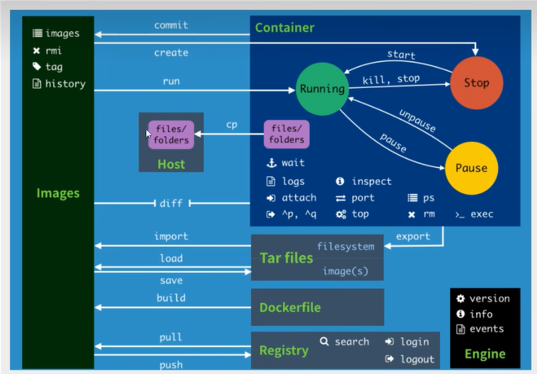


#### 练习

> 安装 nginx

```shell
[root@VM-4-2-centos home]# docker run -d --name nginx -p 3344:80 nginx
Unable to find image 'nginx:latest' locally
latest: Pulling from library/nginx
a2abf6c4d29d: Pull complete
a9edb18cadd1: Pull complete
589b7251471a: Pull complete
186b1aaa4aa6: Pull complete
b4df32aa5a72: Pull complete
a0bcbecc962e: Pull complete
Digest: sha256:0d17b565c37bcbd895e9d92315a05c1c3c9a29f762b011a10c54a66cd53c9b31
Status: Downloaded newer image for nginx:latest
a5434413aa07ce43509beabe825ec2b0ac6a64d3c8245cdc43469d6d7db27ef6
[root@VM-4-2-centos home]# curl http://localhost:3344
<!DOCTYPE html>
<html>
<head>
<title>Welcome to nginx!</title>
<style>
html { color-scheme: light dark; }
body { width: 35em; margin: 0 auto;
font-family: Tahoma, Verdana, Arial, sans-serif; }
</style>
</head>
<body>
<h1>Welcome to nginx!</h1>
<p>If you see this page, the nginx web server is successfully installed and
working. Further configuration is required.</p>

<p>For online documentation and support please refer to
<a href="http://nginx.org/">nginx.org</a>.<br/>
Commercial support is available at
<a href="http://nginx.com/">nginx.com</a>.</p>

<p><em>Thank you for using nginx.</em></p>
</body>
</html>
```


> 安装 tomcat

```shell
# 官方的使用
docker run -it --rm tomcat:9.0
```


> 部署es + kibana

```shell
# es 暴露的端口很多！
# es 十分的耗内存
# es 的数据一般需要放置到安全目录
# --net somenetwork ？ 网络配置

# 启动es
docker run -d --name elasticsearch -p 9200:9200 -p 9300:9300 -e "discovery.type=single-node" elasticsearch:7.6.2

# 启动了 linux就卡住了  docker stats 查看 cpu 的状态

# 测试es是否成功

[root@VM-4-2-centos ~]# curl localhost:9200
{
  "name" : "3b0eee19ec6a",
  "cluster_name" : "docker-cluster",
  "cluster_uuid" : "4xgcf4z9TiqwKPwP3FEohA",
  "version" : {
    "number" : "7.6.2",
    "build_flavor" : "default",
    "build_type" : "docker",
    "build_hash" : "ef48eb35cf30adf4db14086e8aabd07ef6fb113f",
    "build_date" : "2020-03-26T06:34:37.794943Z",
    "build_snapshot" : false,
    "lucene_version" : "8.4.0",
    "minimum_wire_compatibility_version" : "6.8.0",
    "minimum_index_compatibility_version" : "6.0.0-beta1"
  },
  "tagline" : "You Know, for Search"
}

# 赶紧关闭 增加内存限制

# 通过 -e 环境变量修改配置文件
docker run -d --name elasticsearch -p 9200:9200 -p 9300:9300 -e "discovery.type=single-node" -e ES_JAVA_OPTS="-Xms64m --Xms512m" elasticsearch:7.6.2
```

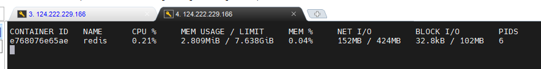


### 可视化

- portainer（先用这个）

```shell
docker run -d -p 8088:9000 --restart=always -v /var/run/docker.sock:/var/run/docker.sock --privileged=true portainer/portainer

# 账号/密码
admin/123qwe!@#
```


- Rancher（CI/CD）

### docker 镜像

#### commit镜像

```shell
docker commit 提交容器称为一个新的副本
# 命令和git原理类似
docker commit -m="提交的描述信息" -a="作者" 容器id 目标镜像名:[TAG]
```

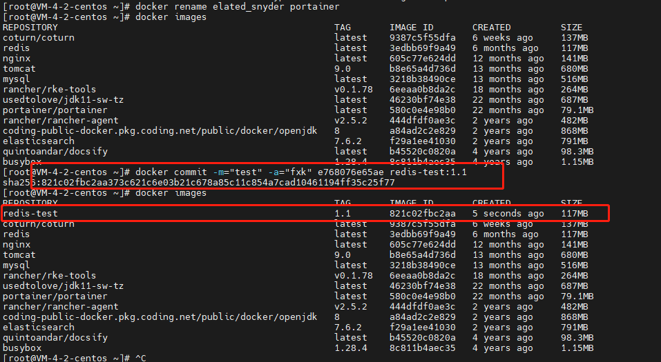


### 容器数据卷

#### 什么是容器数据卷

数据？删除容器，数据就丢失了，我们希望数据可以持久化。

容器质检可以有一个数据共享技术！docker 产生的数据，同步到本地。

这就是数据卷技术！目录的挂载，将我们容器内的目录，挂载到linux目录。

总结：容器的持久化和同步操作！


#### 使用数据卷

> 方式一：直接使用命令来挂载 -v

```shell
docker run -it -v 主机目录：容器内目录

# 测试
docker run -it -v /home/ceshi:/home centos /bin/bash

# 启动起来时候我们可以通过 docker inspect 容器ID
```


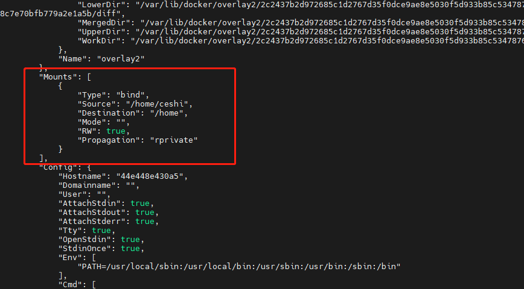

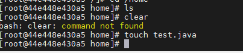

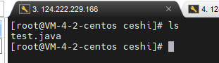


#### mysql 数据持久化

```shell
# 官方命令
docker run --name some-mysql -e MYSQL_ROOT_PASSWORD=my-secret-pw -d mysql:tag

# 启动mysql
-d 后台运行
-p 端口映射
-v 卷挂载
--name 容器名字
docker run -d -p 3310:3306 -v /home/mysql/conf:/etc/mysql/conf.d -v /home/mysql/data:/var/lib/mysql -e MYSQL_ROOT_PASSWORD=123456 --name mysql01 mysql:5.7

# 即使将容器删除，挂载到本地的数据卷依旧没有丢失，这就实现了容器数据持久化功能
```

#### 具名挂载和匿名挂载

```shell
# 匿名挂载
-v 容器内路径
docker run -d -P --name nginx01 -v /etc/nginx nginx
```

```shell
# 查看所有的volume的情况
[root@VM-4-2-centos mysql]# docker volume ls
DRIVER    VOLUME NAME
local     1fc8309dd7cccac7c3c92c1b0c36ead86131c65350090743a7aed6f4d63c28f4

# 查看挂载地址
docker volume inspect 1fc8309dd7cccac7c3c92c1b0c36ead86131c65350090743a7aed6f4d63c28f4
```

```shell
# 如何确定是具名挂载，还是指定路径挂载
-v 容器内路径       #匿名挂载
-v 卷名::容器内路径  #具名挂载
-v /宿主机路径::容器内路径 # 指定路径挂载
```

拓展：

```shell
# 通过 -v 容器内路径：ro rw 改变读写权限
ro  readonly  # 只读
rw  readwrite # 可读可写 默认的
docker run -d -p --name nginx02 -v juming-nginx:/etc/nginx:ro nginx
docker run -d -p --name nginx02 -v juming-nginx:/etc/nginx:rw nginx
```


#### 数据卷容器

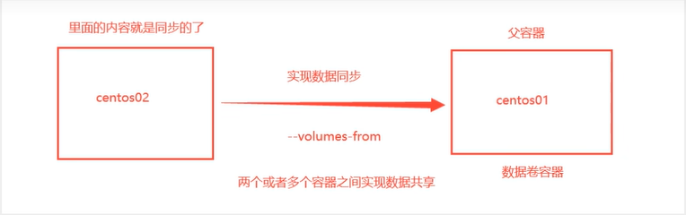

多个容器实现数据共享

```shell
--volumes-form 
```

容器质检配置信息传递，数据卷的生命周期一直持续到没有容器使用未知。

### DockerFile

DockerFile 就是用来构建 docker 镜像的构建文件、命令脚本。

通过这个脚本可以生成镜像。

```shell
FROM centos

VOLUME ["volume01", "volume02"]

CMD echo "----end----"
CMD /bin/bash
```

```shell
[root@VM-4-2-centos docker-test-volume]# docker build -f dockerfile1 -t kuangshen/centos:1.0 .
Sending build context to Docker daemon  2.048kB
Step 1/4 : FROM centos
 ---> 5d0da3dc9764
Step 2/4 : VOLUME ["volume01", "volume02"]
 ---> Running in 7a66ea59f222
Removing intermediate container 7a66ea59f222
 ---> eee52d7fb3bd
Step 3/4 : CMD echo "----end----"
 ---> Running in bcd890ecf524
Removing intermediate container bcd890ecf524
 ---> 3ce915678658
Step 4/4 : CMD /bin/bash
 ---> Running in e9c96bbb7279
Removing intermediate container e9c96bbb7279
 ---> 1851c6dcc011
Successfully built 1851c6dcc011
Successfully tagged kuangshen/centos:1.0

```

构建步骤：

1. 编写一个dockerfile文件
2. docker build 构建称为一个镜像
3. docker run 运行镜像
4. docker push 发布镜像（dockerHub、阿里云镜像仓库）

很多官方镜像都是基础包，很多功能没有，我们通常会自己搭建自己的镜像！

#### dockerfile 构建过程

**基础知识：**

1. 每个保留关键字（指令）都必须是大写字母
2. 执行从上到下顺序执行
3. `#` 表示注释
4. 每个指令都会创建提交一个新的镜像层，并提交


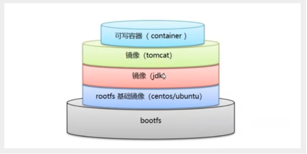

dockerfile 是面向开发的，我们以后要发布项目，做镜像就要编写dockerfile。

#### dockerfile 指令


```shell
CMD        # 指定这个容器启动时要运行的命令，只有最后一个会生效，可被替代
ENTRYPOINT # 指定这个容器启动时要运行的命令，可以追加命令
ONBUILD    # 当构建一个被继承 dockerfile 这个时候就会运行 ONBUILD 的指令。触发指令。
COPY       # 类似 ADD 命令，将文件拷贝到镜像中
ENV        # 构建的时候设置环境变量
```


```shell
# 1. 编写 dockerfile 文件 
[root@VM-4-2-centos dockerfile]# cat test
FROM centos:9
MAINTAINER fxk<2284711614@qq.com>
ENV MYPATH /usr/local
WORKDIR $MYPATH

# RUN yum -y install vim
# RUN yum -y install net-tools

EXPOSE 80

CMD echo $MYPATH
CMD echo "---end---"
CMD /bin/bash
```


```shell
# 2. 测试运行
[root@VM-4-2-centos dockerfile]# docker build -f test -t mycentos:0.1 .
Sending build context to Docker daemon  2.048kB
Step 1/8 : FROM centos
 ---> 5d0da3dc9764
Step 2/8 : MAINTAINER fxk<2284711614@qq.com>
 ---> Using cache
 ---> f724c454229a
Step 3/8 : ENV MYPATH /usr/local
 ---> Using cache
 ---> 6c925f08bae8
Step 4/8 : WORKDIR $MYPATH
 ---> Using cache
 ---> 37c9bf4e7b7f
Step 5/8 : EXPOSE 80
 ---> Running in 86eaaceb9116
Removing intermediate container 86eaaceb9116
 ---> 9775434206b2
Step 6/8 : CMD echo $MYPATH
 ---> Running in 445e84053ac3
Removing intermediate container 445e84053ac3
 ---> 87e133fcf4ef
Step 7/8 : CMD echo "---end---"
 ---> Running in 093d7250afdd
Removing intermediate container 093d7250afdd
 ---> 68551ca80077
Step 8/8 : CMD /bin/bash
 ---> Running in 0eab4625ba43
Removing intermediate container 0eab4625ba43
 ---> 79873e615d52
Successfully built 79873e615d52
Successfully tagged mycentos:0.1
```

> CMD 和 ENTRYPOINT 区别

```shell
[root@VM-4-2-centos dockerfile]# vim docker-cmd-test
FROM centos
CMD ["ls", "-a"]

[root@VM-4-2-centos dockerfile]# docker build -f docker-cmd-test -t 
Successfully built 2b3bdf6fd384
Successfully tagged cmdtest:latest
[root@VM-4-2-centos dockerfile]# docker run 2b3bdf6fd384
.
..
.dockerenv
bin
dev
etc
home
lib
lib64
lost+found
```

ENTRYPOINT 

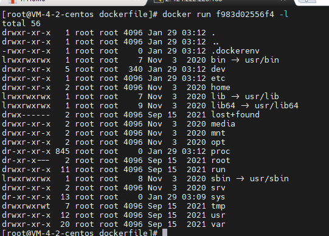

CMD

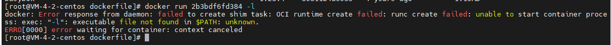

dockerfile 中很多命令都十分的相似，我们需要了解他们的区别

#### tomcat 镜像

1. 准备tomcat压缩包、jdk压缩包

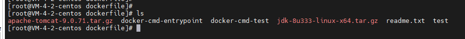

2. 编写dockerfile文件，官方命名`Dockerfile`，build会自动寻找这个文件，就不需要`-f`指定了。

```shell
FROM centos

COPY readme.txt /usr/local/readme.txt

ADD jdk-8u333-linux-x64.tar.gz /usr/local/
ADD apache-tomcat-9.0.71.tar.gz /usr/local/

ENV MYPATH /usr/local
WORKDIR $MYPATH

ENV JAVA_HOME /usr/local/jdk1.8.0_333
ENV CLASSPATH $JAVA_HOME/lib/dt.java;$JAVA_HOME/lib/tools.jar
ENV CATALINA_HOME /usr/local/apache-tomcat-9.0.71
ENV CATALINA_BASH /usr/local/apache-tomcat-9.0.71
ENV PATH $PATH:$JAVA_HOME/bin;$CATALINA_HOME/lib;$CATALINA_HOME/bin

EXPOSE 8080
CMD /usr/local/apache-tomcat-9.0.71/bin/startup.sh && tail -F /usr/local/apache-tomcat-9.0.71/bin/logs/catalina.out
```


3. 构建镜像

```shell
# docker build -t diytomcat .
```

4. 启动镜像
5. 访问测试
6. 发布项目（由于做了卷挂载，直接在本地编写项目发布）

```shell
<?xml version="1.0" encoding="UTF-8"?>
<web-app xmlns:xsi="http://www.w3.org/2001/XMLSchema-instance"
    xmlns="http://java.sun.com/xml/ns/javaee"
    xmlns:web="http://java.sun.com/xml/ns/javaee/web-app_2_5.xsd"
    xsi:schemaLocation="http://java.sun.com/xml/ns/javaee http://java.sun.com/xml/ns/javaee/web-app_2_5.xsd"
    id="WebApp_ID" version="2.5">
    
    
</web-app>
```


```jsp
<%@ page language="java" contentType="text/html; charset=UTF-8" pageEncoding="UTF-8" %>
<!DOCTYPE html>
<html>

<head>
       <meta charset="utf-8">
       <title>test</title>
</head>

<body>
       Hello World!<br />
       <% out.println("你的 IP 地址 " + request.getRemoteAddr()); %>
</body>
</html>[
```


```shell
[root@VM-4-2-centos test]# docker run -d -p 9090:8080 --name fxktomcat -v /home/kuangshen/build/tomcat/test:/usr/local/apache-tomcat-9.0.71/webapps/test  -v /home/kuangshen/build/tomcat/tomcatlogs/:/usr/local/apache-tomcat-9.0.71/logs diytomcat
```

项目部署成功，可以直接访问

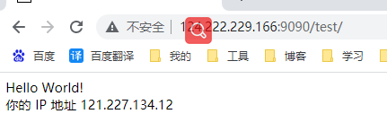

#### 发布自己的镜像

> DockerHub

1. 注册账号 https://hub.docker.com/
2. 确定账号可以登录
3. 在服务器上登录

```shell
[root@VM-4-2-centos test]# docker login --help

Usage:  docker login [OPTIONS] [SERVER]

Log in to a Docker registry.
If no server is specified, the default is defined by the daemon.

Options:
  -p, --password string   Password
      --password-stdin    Take the password from stdin
  -u, --username string   Username
```

4. 登录完毕后就可以提交镜像了


> 阿里云镜像

1. 登录阿里云
2. 找到容器镜像服务
3. 创建命名空间
4. 创建容器镜像
5. 浏览信息


### Docker 网络原理

#### 理解 Docker0

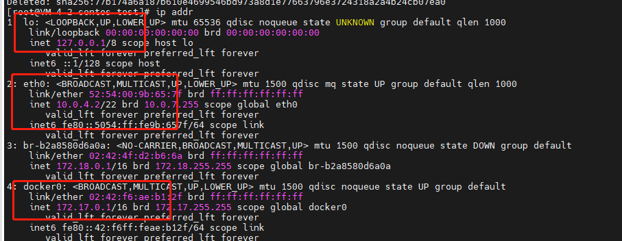

linux 可以ping通 容器内部

> 原理

1. 我们每启动一个docker容器，docker就会给docker容器分配一个ip，只要安装了docker，就会有一个docker0，桥接模式，使用的技术是evth-pair技术；

```shell
# evth-pair 就是一堆的虚拟设备皆苦，他们都是成对出现的，一段连着协议，一段彼此相连
# 正因为有这个特性，evth-pair 充当一个桥梁，连接着各种虚拟网络设备
# OpenStac，Docker 容器之间的链接，OVS的链接，都是使用 evth-pair 技术
```

```shell
# 容器和容器之间是互通的
```

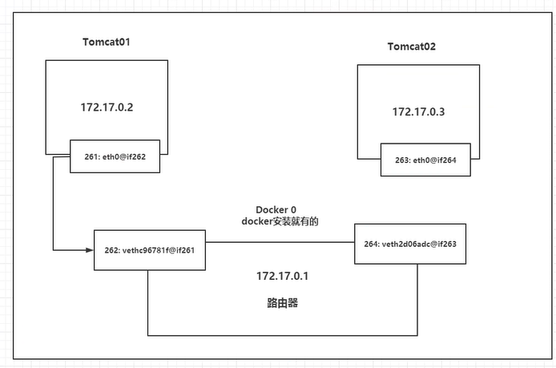

结论： tomcat01 和 tomcat02 是公用的路由器，docker0.

所有的容器不指定网络的情况下，都是docker0路由的，docker会给我们的容器分配一个默认的可用IP

> 小结

Docker 使用的是Linux的桥接，宿主机中是一个Docker容器的网桥 docker0

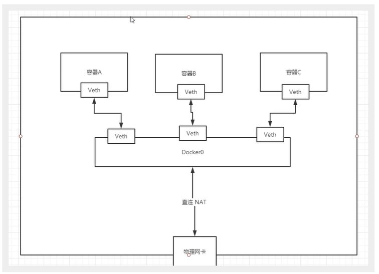

Docker 中所有的网络接口都是虚拟的。虚拟的转发效率高。（内网）

只要删除容器，对应的网桥一对就没了。

```shell
docker inspect 容器ID
```

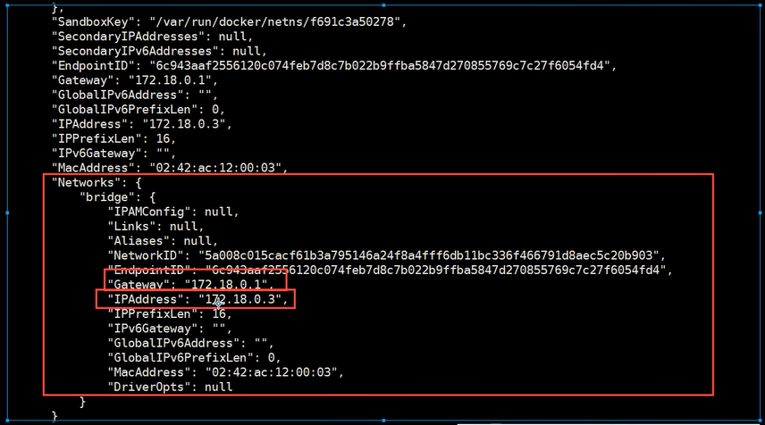

#### -- link

```shell
# hosts
# docker exec -it tomcat03 cat /etc/hosts

```

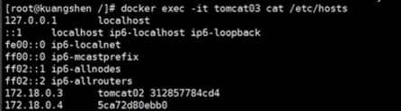

--link 就是在 hosts 配置中增加了一个 172.18.0.3 tomcat02 的配置

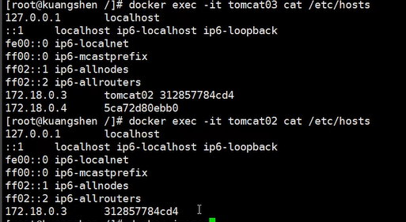

我们现在用Docker 已经不建议使用 --link了！

docker0问题：不支持容器名链接访问！

#### 自定义网络

>  查看所有的docker网络

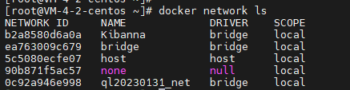


**网络模式**

bridge: 桥接 docker

none：不配置网络

host：和宿主机共享网络

container：容器内网络连通（局限性大）

**测试**

```shell
# 我们直接启动的命令 --net bridge，二这个就是我们的docker0
docker run -d -P --name tomcat01 tomcat 
docker run -d -P --name -net bridge tomcat 

# docker0 特点，默认域名，不能访问， --link可以打通链接

# 我们可以自定义一个网络
# --driver bridge
# --subnet 192.168.0.0/16 192.168.0.2-192.168.255.255
# --gateway 192.168.0.1
[root@VM-4-2-centos ~]# docker network create --driver bridge --subnet 192.168.0.0/16 --gateway 192.168.0.1 mynet
7192867db5793fbe3379f14b821e9153c8d2953414d24104fb402b7994cc8a1a

Run 'docker network COMMAND --help' for more information on a command.
[root@VM-4-2-centos ~]# docker network ls
NETWORK ID     NAME             DRIVER    SCOPE
b2a8580d6a0a   Kibanna          bridge    local
ea763009c679   bridge           bridge    local
5c5080ecfe07   host             host      local
7192867db579   mynet            bridge    local
90b871f5ac57   none             null      local
0c92a946e998   ql20230131_net   bridge    local

[root@VM-4-2-centos ~]# docker network inspect mynet
[
    {
        "Name": "mynet",
        "Id": "7192867db5793fbe3379f14b821e9153c8d2953414d24104fb402b7994cc8a1a",
        "Created": "2023-02-07T11:14:54.361606419+08:00",
        "Scope": "local",
        "Driver": "bridge",
        "EnableIPv6": false,
        "IPAM": {
            "Driver": "default",
            "Options": {},
            "Config": [
                {
                    "Subnet": "192.168.0.0/16",
                    "Gateway": "192.168.0.1"
                }
            ]
        },
        "Internal": false,
        "Attachable": false,
        "Ingress": false,
        "ConfigFrom": {
            "Network": ""
        },
        "ConfigOnly": false,
        "Containers": {},
        "Options": {},
        "Labels": {}
    }
]

```


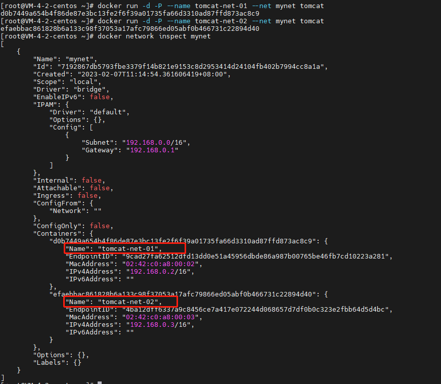

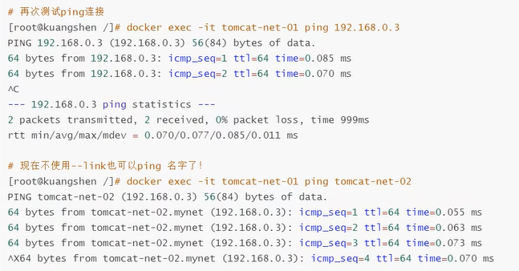

好处：

redis - 不同的集群使用不同网络，保证集群是安全和健康的


#### 网络连通

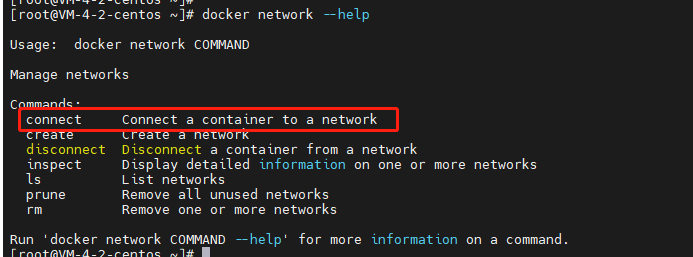

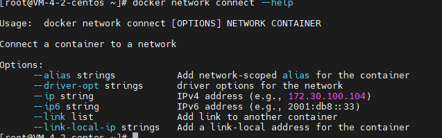


```shell
# 测试打通 omcat01 - mynet

[root@VM-4-2-centos ~]# docker network connect mynet tomcat01
[root@VM-4-2-centos ~]# docker network inspect mynet
# 连通之后将tomcat01 放到了mynet网络下
# 一个容器两个ip地址
```

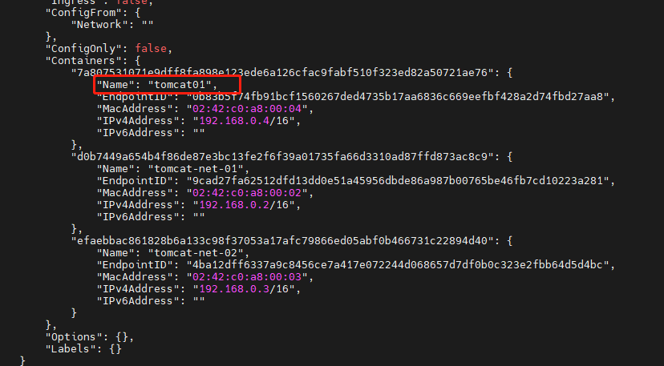

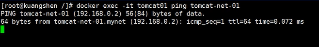

结论：假设要跨网络操作别人，就需要使用 `docker network connect` 连通

#### 实战：部署Reids集群

**分片 + 高可用 + 负载集群**

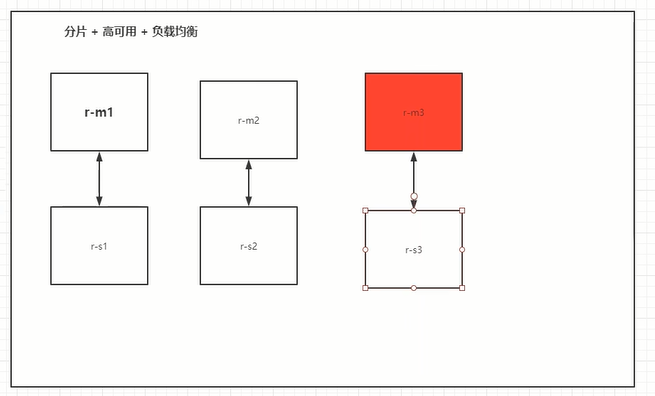


```shell
# 创建网络
[root@VM-4-2-centos ~]# docker network create redis --subnet 172.38.0.0/16
13a5d6121da3b9130aaabc5e4634d51dbc41d4ef73f4e2d1b2903897f2c002e0
[root@VM-4-2-centos ~]# docker network inspect redis
[
    {
        "Name": "redis",
        "Id": "13a5d6121da3b9130aaabc5e4634d51dbc41d4ef73f4e2d1b2903897f2c002e0",
        "Created": "2023-02-07T13:31:20.178652211+08:00",
        "Scope": "local",
        "Driver": "bridge",
        "EnableIPv6": false,
        "IPAM": {
            "Driver": "default",
            "Options": {},
            "Config": [
                {
                    "Subnet": "172.38.0.0/16"
                }
            ]
        },
        "Internal": false,
        "Attachable": false,
        "Ingress": false,
        "ConfigFrom": {
            "Network": ""
        },
        "ConfigOnly": false,
        "Containers": {},
        "Options": {},
        "Labels": {}
    }
]
```


```shell
# shell 脚本
for port in $(seq 1 6);\
do \
mkdir -p /mydata/redis/node-${port}/conf
touch /mydata/redis/node-${port}/conf/redis.conf
cat << EOF >/mydata/redis/node-${port}/conf/redis.conf
port 6379
bind 0.0.0.0
cluster-enabled yes
cluster-config-file nodes.conf
cluster-node-timeout 5000
cluster-announce-ip 172.38.0.1${port}
cluster-announce-port 6379
cluster-announce-bus-port 16379
appendonly yes
EOF
done
```


```shell
docker run -p 6371:6379 -p 16371:16379 --name redis-1 -v /mydata/redis/node-1/data:/data -v /mydata/redis/node-1/conf/redis.conf:/etc/redis/redis.conf -d --net redis --ip 172.38.0.11 redis:5.0.9-alpine3.11 redis-server /etc/redis/redis.conf

docker run -p 6372:6379 -p 16372:16379 \
--name redis-2 \
-v /mydata/redis/node-2/data:/data \
-v /mydata/redis/node-2/conf/redis.conf:/etc/redis/redis.conf \
-d --net redis --ip 172.38.0.12 redis:5.0.9-alpine3.11 redis-server /etc/redis/redis.conf

docker run -p 6373:6379 -p 16373:16379 \
--name redis-3 \
-v /mydata/redis/node-3/data:/data \
-v /mydata/redis/node-3/conf/redis.conf:/etc/redis/redis.conf \
-d --net redis --ip 172.38.0.13 redis:5.0.9-alpine3.11 redis-server /etc/redis/redis.conf

docker run -p 6376:6379 -p 16376:16379 \
--name redis-6 \
-v /mydata/redis/node-6/data:/data \
-v /mydata/redis/node-6/conf/redis.conf:/etc/redis/redis.conf \
-d --net redis --ip 172.38.0.16 redis:5.0.9-alpine3.11 redis-server /etc/redis/redis.conf
```


**集群配置**

```shell
/data # redis-cli --cluster create \
> 172.38.0.11:6379 \
> 172.38.0.12:6379 \
> 172.38.0.13:6379 \
> 172.38.0.14:6379 \
> 172.38.0.15:6379 \
> 172.38.0.16:6379 \
> --cluster-replicas 1
```

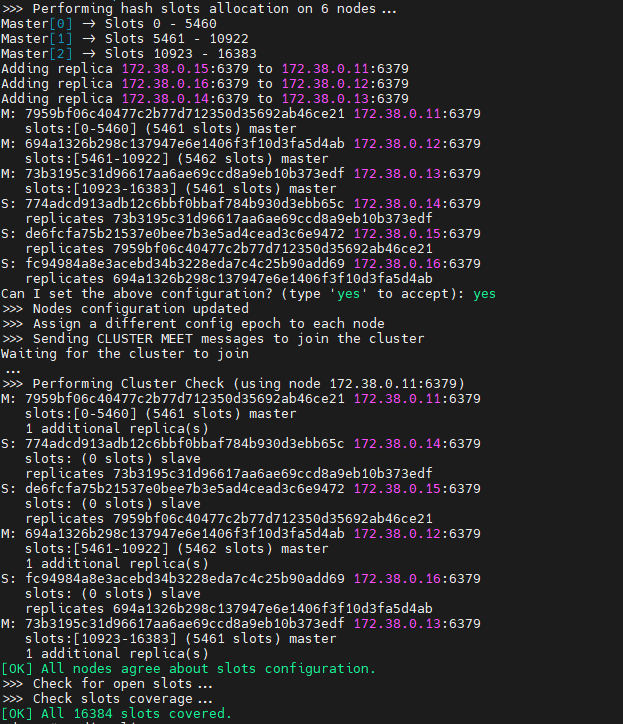

```shell
/data # redis-cli -c
127.0.0.1:6379> cluster info
cluster_state:ok
cluster_slots_assigned:16384
cluster_slots_ok:16384
cluster_slots_pfail:0
cluster_slots_fail:0
cluster_known_nodes:6
cluster_size:3
cluster_current_epoch:6
cluster_my_epoch:1
cluster_stats_messages_ping_sent:103
cluster_stats_messages_pong_sent:106
cluster_stats_messages_sent:209
cluster_stats_messages_ping_received:101
cluster_stats_messages_pong_received:103
cluster_stats_messages_meet_received:5
cluster_stats_messages_received:209
```

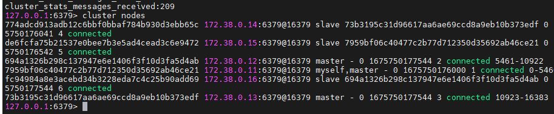


把13停掉，看看数据还在不在，看到14已经成为master了，数据也可以get到。

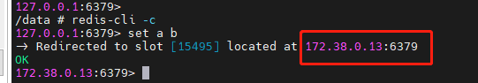

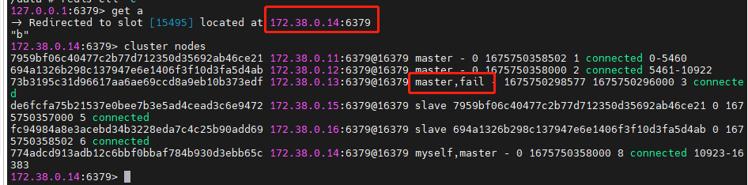


### IDEA 整合Docker

### Docker Compose

### Docker Swarm

### CI\CD jenkins


