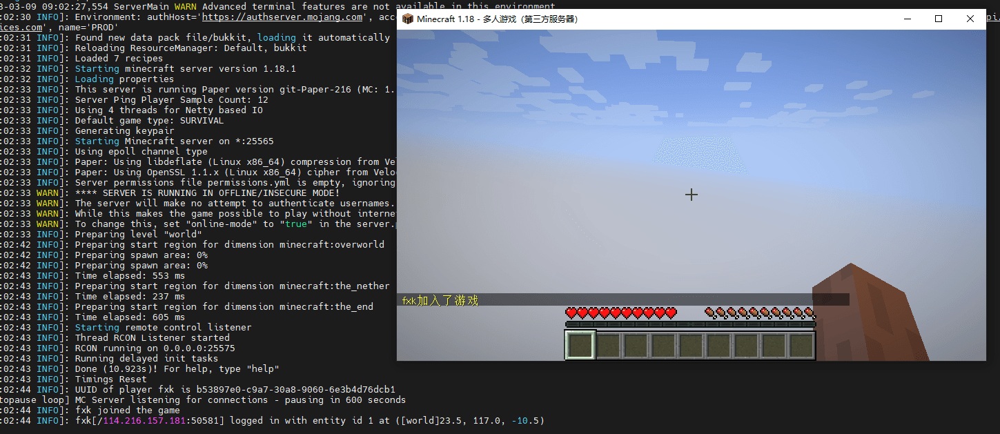

---
tags:
  - Docker
  - 游戏
  - Minecraft
---

保证内存至少大于1G，保证`25565`端口可以访问

```shell
docker run -d \
-p 25565:25565 \
-e EULA=TRUE \
-e TYPE=PAPER \
-e ONLINE_MODE=FALSE \
-e VERSION=1.18.1 \
-e FORCE_REDOWNLOAD=false \
-e ENABLE_AUTOPAUSE=true \
-e DEBUG_MEMORY=true \
-e DEBUG_EXEC=true \
-e MEMORY=1G \
--restart=unless-stopped \
--name mc \
itzg/minecraft-server:java17
```

查看日志

```shell
docker logs mc
```

看到以下日志就说明启动成功了

```shell
[09:19:30 INFO]: Starting remote control listener
[09:19:30 INFO]: Thread RCON Listener started
```

我装的是hmcl的mc客户端

https://hmcl.huangyuhui.net/download

我玩的版本是`1.18.1`，多人游戏里面选择服务器，填入我们的服务器链接就可以加入游戏了

