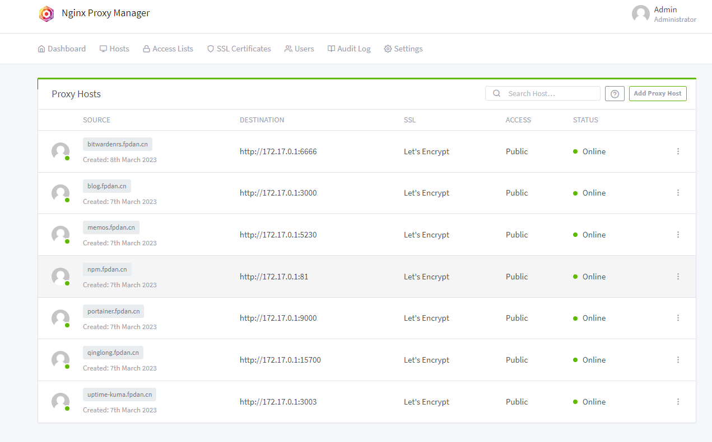
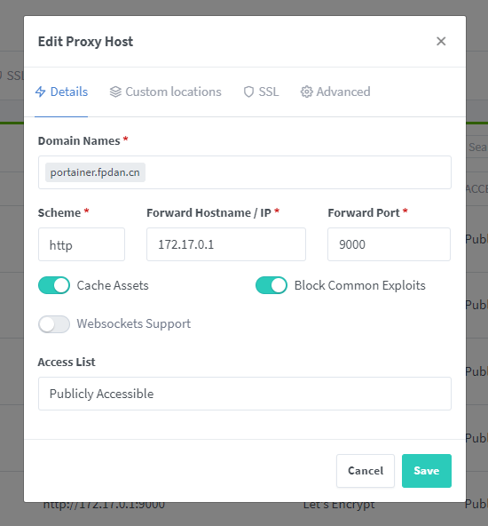
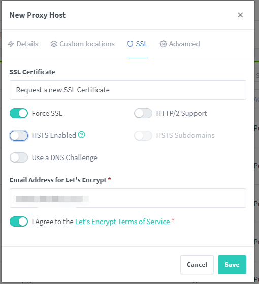
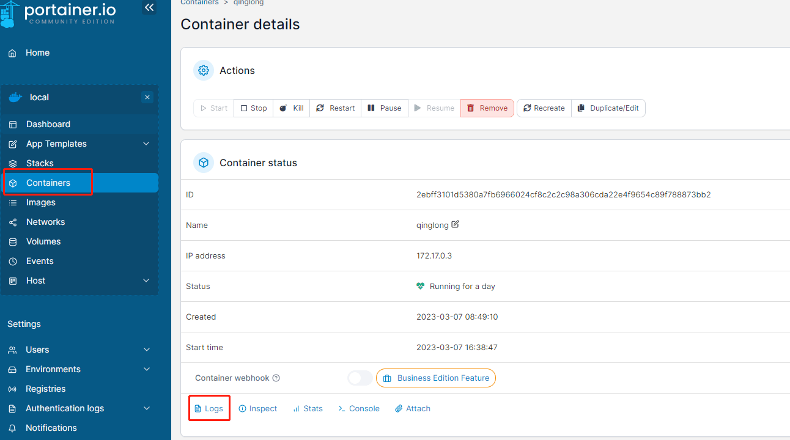
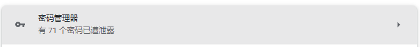
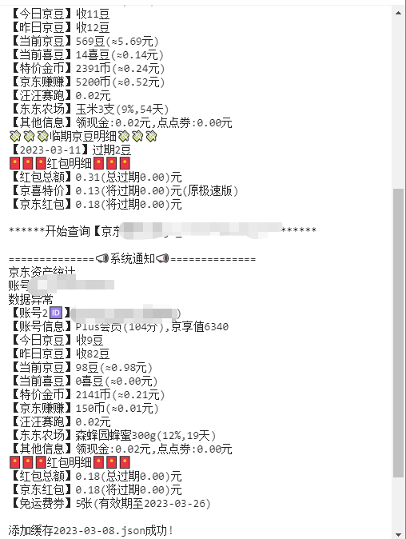

---
tags:
  - Docker
  - 工具
  - 有趣
---

#### 环境

```shell
[root@VM-4-2-opencloudos nginx-proxy-manager]# docker version
Client: Docker Engine - Community
 Version:           20.10.5
 
[root@VM-4-2-opencloudos nginx-proxy-manager]# docker-compose version
Docker Compose version v2.4.1
```


如果你对`docker` 不熟悉，并且想学习一下，可以通过下面视频学习一下

https://www.bilibili.com/video/BV1og4y1q7M4/?spm_id_from=333.999.0.0

这是我自己做的笔记，[docker学习笔记](https://blog.fpdan.cn/#/%E6%8A%80%E6%9C%AF/docker%E5%AD%A6%E4%B9%A0%E7%AC%94%E8%AE%B0)


#### Nginx Proxy Manager

可以申请`ssl`证书，很方便的配置反向代理




```shell
vim docker-compose.yml
```

```shell
version: '3'
services:
  app:
    image: 'jc21/nginx-proxy-manager:latest'
    restart: unless-stopped
    ports:
      - '80:80'  # 冒号左边可以改成自己服务器未被占用的端口
      - '81:81'  # 冒号左边可以改成自己服务器未被占用的端口
      - '443:443' # 冒号左边可以改成自己服务器未被占用的端口
    volumes:
      - ./data:/data # 冒号左边可以改路径，现在是表示把数据存放在在当前文件夹下的 data 文件夹中
      - ./letsencrypt:/etc/letsencrypt  # 冒号左边可以改路径，现在是表示把数据存放在在当前文件夹下的 letsencrypt 文件夹中
```

```shell
docker-compose up -d 
```

如果你装过`nginx` 可能会有端口占用问题，关闭你的`nginx`。

如果没有安装`docker-compose`可以看下面资料自己安装


参考资料：

https://blog.laoda.de/archives/nginxproxymanager


#### portainer 容器管理

```shell
docker run -d \
-p 9000:9000 \
--restart=always \
--name portainer \
portainer/portainer
```


NPM 配置一下，域名和代理，顺便申请个SSL证书。





`portainer` 就是简单的看一下你容器的状态，对于集聪明才智于一身、精通docker命令的你其实没什么卵用。

至少不用 `docker logs xx` 查看容器日志。



哦，你们用的是`ELK`，那没事了。


#### bitwardenrs 密码管理

```shell
docker run -d --name bitwardenrs \
  --restart=always \
  -e WEBSOCKET_ENABLED=true \
  -v $PWD/bitwardenrs:/data/ \
  -p 6666:80 \
  -p 3012:3012 \
  vaultwarden/server:latest
```

`$PWD` 表示当前目录，因为是密码管理，所以还是要挂载一下数据的。

我感觉用处不大。



只是看到谷歌提示我密码泄露让我有点焦虑。。。


参考资料：

https://blog.laoda.de/archives/bitwarden-docker-install

#### 青龙面板

```shell
docker run -dit \
  --privileged=true \
  -v $PWD/ql/data:/ql/data\
  -p 15700:5700 \
  -p 5701:5701 \
  --name qinglong \
  --hostname qinglong \
  --restart=always \
  whyour/qinglong:latest
```

因为擦边，所以还是要挂载一下数据的。

一个月一包烟钱。



参考资料：

https://github.com/6dylan6/jdpro

#### 我的博客

[coding自动化部署的](https://blog.fpdan.cn/#/%E6%8A%80%E6%9C%AF/coding%E8%87%AA%E5%8A%A8%E5%8C%96%E9%83%A8%E7%BD%B2%E9%A1%B9%E7%9B%AE)


#### memos 备忘录

```shell
docker run -d \
--name memos \
-p 5230:5230 \
-v $PWD/memos/:/var/opt/memos \
neosmemo/memos:latest
```

文档类的挂载一下

参考资料：

https://blog.laoda.de/archives/docker-install-memos#5.-%E6%90%AD%E5%BB%BA%E6%96%B9%E5%BC%8F


#### coreDNS

参考资料：

https://blog.fpdan.cn/#/%E6%8A%80%E6%9C%AF/coreDNS


感谢蓝易云对本项目的赞助，鞠躬 ♪(･ω･)ﾉ

[【活动】送服务器啦！蓝易云征文大赛](https://fishpi.cn/article/1677580643943)
